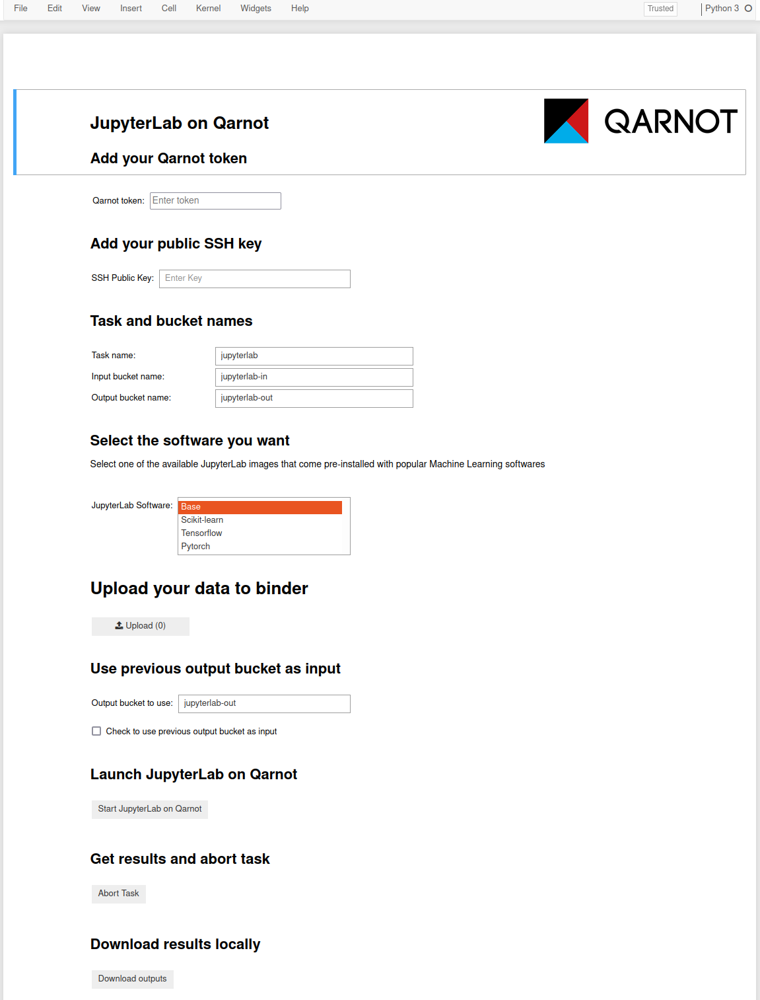
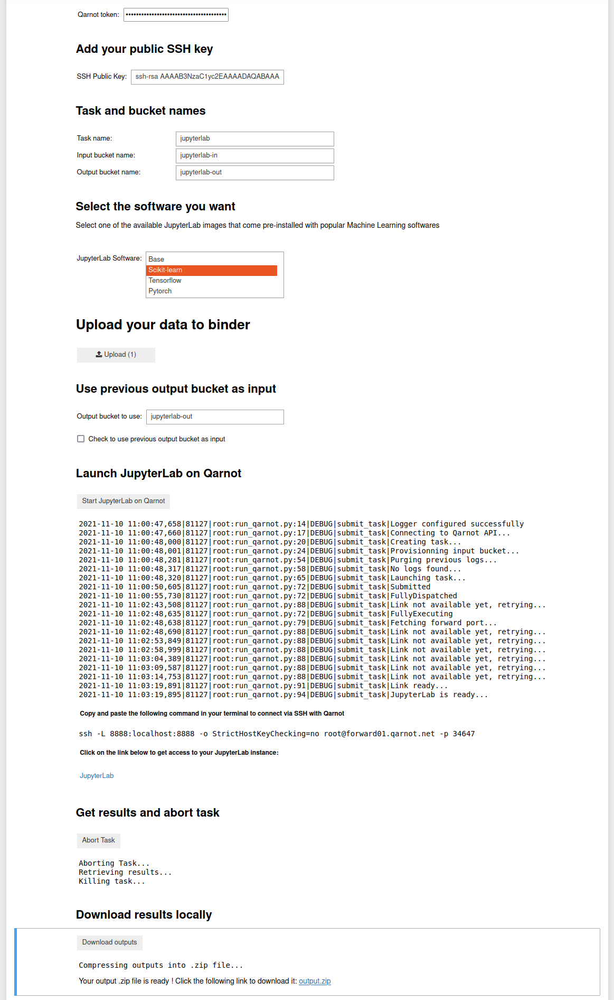

# Table of Contents
- [Table of Contents](#table-of-contents)
  - [JupyterLab on Qarnot](#jupyterlab-on-qarnot)
  - [Contents](#contents)
  - [How to run](#how-to-run)
    - [Binder limitations](#binder-limitations)
  - [JupyterLab form parameters](#jupyterlab-form-parameters)
    - [Note about reusing output bucket](#note-about-reusing-output-bucket)
  - [Launching JupyterLab](#launching-jupyterlab)
  - [Getting Results](#getting-results)
  - [Note about uploading files](#note-about-uploading-files)

## JupyterLab on Qarnot

JupyterLab is a web-based interactive development environment for Jupyter notebooks, code, and data. It is flexible: configure and arrange the user interface to support a wide range of workflows in data science, scientific computing, and machine learning.

Below is how to launch a JupyterLab instance on Qarnot through a Jupyter notebook hosted on binder with minimal user intervention using a GUI based on *ipywidgets*.

## Contents

* `jupyterlab.ipynb`: notebook with graphical interface to launch the task on Qarnot.
* `postBuild`: post build file specific to Binder, used to set the notebook as trusted on launch.
* `python_logging.conf`: file containing logging local binder configuration
* `requirements.txt`: pip requirements file of python modules needed for binder.
* `run_qarnot.py`: python script for launching the task through the Qarnot SDK. Will be executed through the notebook.

## How to run

* You can click on the following button to launch the notebook on Binder .
* You should get access to the following page on your browser
  

### Binder limitations

**File size**

* By default, jupyter limits file size transfers to 10MB. Trying to upload a larger file restarts the notebook kernel.
* This has been increased to a theoretical limit of 500MB through the use of the .jupyter/jupyter_notebook_config.py file.
* However it seems that trying ot upload a file larger than ~300MB (could be a bit lower) crashes the browser tab.
* This appears to be a limitation of the browser.

**RAM**

* While running, users are guaranteed at least 1GB of RAM, with a maximum of 2GB

**Time**

* Binder will automatically shut down user sessions that have more than 10 minutes of inactivity (if you leave the jupyter notebook window open in the foreground, this   will generally be counted as “activity”).

* Binder aims to provide up to six hours of session time per user session, or up to one cpu-hour for more computationally intensive sessions. Beyond that, we   cannot guarantee that the session will remain running

## JupyterLab form parameters

In order to launch the JupyterLab instance on Qarnot, the user has to fill-in the following parameters
* Your secret Qarnot token
* Your public SSH key
* Select which software package you want to use : corresponds to a docker image containing different pre-installed Machine Learning & Deep Learning libraries.
* Upload your input files: can be data files, text files, any type of file you want to use with your JupyterLab instance.
* Choose wether you want to use your previous output bucket as an input bucket. This is mainly useful if you want to continue working on your previous notebook with any python packages you may have installed previously.
  
### Note about reusing output bucket
* There is a an optional check box to use the previous output bucket as an input bucket.
* This feature is used for picking up where you last left off from your work session on Qarnot.
* It can contain the following files: 
  * your previous notebooks along with their respective checkpoints so you can continue to work on them in a seamless way
  * two pip requirement files `requirements.txt` and `requirements-full.txt` in order to replicate your previous virtual environment with any python packages you may have downloaded
    * `requirements.txt` contains only the packages that were installed directly by the user and that are not dependencies of other packages. This file will be used to download your python packages at task startup so that everything is ready to go once you get into you JupyterLab interface.
    * `requirements-full.txt` is an optional file that contains all the packages present in your previous virtual environment (dependencies included)
    * These files can be used simply from your Jupyter notebook, for example by running: `!pip install -r requirements.txt` in a cell.
  * any other files you might have created during your work session (images, text files, scripts, models etc...)

## Launching JupyterLab

* Once all parameters have been set, all you have to do is click on the `Start JupyterLab on Qarnot`
* You can monitor your task's progress through live logs
* Once everything is ready, you will have the following outputs in your Binder notebook
  

  
* Copy and paste the SSH command in your local terminal to establish the SSH tunneling with Qarnot.
* Then click on the link to be redirected to your JupyterLab instance running on Qarnot.

>* In some rare cases (when using preemptible tasks to launch the Jupyter Lab), the task can be interrupted and restarted again. 
>* If this happens, you will lose your ssh connection and will have to either restart a new task from the notebook form or reconnect manually and get the new token from the Qarnot console.
>* However, your progress should be saved in your output bucket and you can reuse it as was mentioned earlier
## Getting Results

* Once you are done you can retrieve your results from Qarnot and kill the task by clicking on the `Abort Task` button
* In order to download an archive of your results, just click on `Download Results` and a link will be generated for you to download a `zip` file with all of your outputs.
* The final notebook interface should look like this

  

## Note about uploading files
* It is possible to upload various files from your local machine to the Jupyter Lab instance running on Qarnot without having to go through SDK or console. To do so simply click on the arrow shaped button 
 
  